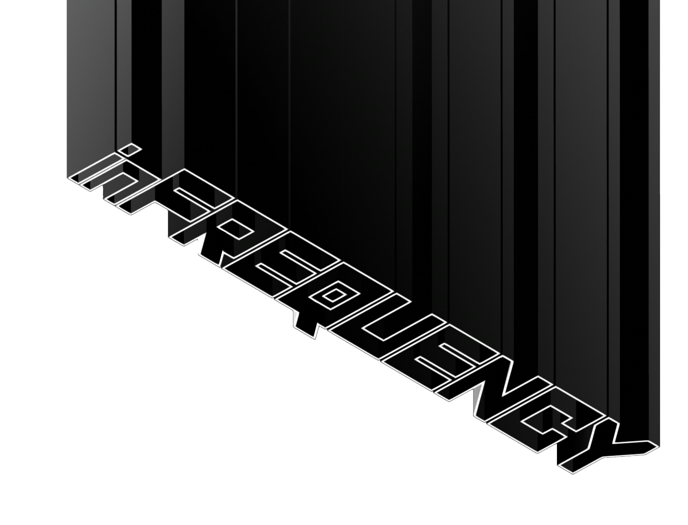

# A Livecoding Workshop

&nbsp;

## Livecoded Audio with Minitidal (Tidalcycles)

Open https://estuary.mcmaster.ca and enter "Solo Mode"

*Estuary is a free online tool for making music and visuals in a browser*

Choose **Minitidal** from the language selection box

*Minitidal is based on the popular [Tidalcycles](https://tidalcycles.org/) livecoding language*

`bd` is a bass drum sample (sound)

You can play the sound once per cycle using:

```
sound "bd"
```

**Stop** the sound by putting `--` in front of it, or delete all the code and evaluate an empty cell

```
-- sound "bd"
```

You can add more `bd` events to play the sound more times per cycle

```
sound "bd bd bd bd"
```

On the fourth step, the bass drum sound will be played twice

```
sound "bd bd bd [bd bd]"
```

This can also be written using the multiplication symbol `*`

```
sound "bd bd bd bd*2"
```

Try replacing the `*` with some different punctuation symbols

 - `!` exclamation
 - `/` divide by
 - `@` *at* symbol

Here are some other sounds to try

| `~` | `hh` | `cp` | `sd` | `sprvibe` | `flbass` |
|-----|------|------|------|-----------|----------|

You can make a pattern play faster using `fast`

```
fast 2 $ sound "bd ~ [cp bd] bd"
```

What do you think `slow` might do instead of `fast`?

`# speed` is an effect to change the pitch of a note, making the pitch higher or lower

```
sound "bd bd" # speed 2
```

`every` will apply a function or effect after a number of cycles

```
every 4 (fast 2) $ sound "bd ~ [cp bd] bd"
```

to apply an effect to `every`, you need to add a `#`

```
every 4 (# speed 2) $ sound "bd ~ [cp bd] bd"
```

`numbers` is a folder of samples of someone counting

```
sound "numbers"
```

You can use a colon `:` after the sample name to access different samples in the sample folder

```
sound "numbers:0 numbers:1 numbers:2 numbers:3"
```

If a sound plays for a long time and overlaps with the next sound, you can use `# cut 1` to stop it when the next sample plays:

```
sound "moog" # cut 1
```

*Note: you can see all the sounds by typing `!localview audiomap` into the terminal/chat box of a new estuary tab*

More functions to try:

| `rev` | `palindrome` | `hurry` | `chop` | `sometimes` | `someCyclesBy` |
|-------|--------------|---------|--------|-------------|--------------|

More effects to try:

| `# gain` | `# end` | `# vowel` | `# pan` | `# hcutoff` | `# cutoff` |
|----------|---------|-----------|---------|-------------|------------|


Choose **Punctual** from the language selection box

*[Punctual](https://github.com/dktr0/Punctual) is an audio/visual livecoding language, we'll just be using the visuals today*

`circle` creates a circle

To make a circle appear on our screen, we need to tell it the **position**, the width or **diameter** we want it to have, and the **output** we want it to use (`rgb` in this case)

```
circle [0,0] 0.5 >> rgb;
```

To remove our circle, we can **comment** the line, or delete the pattern and evaluate the empty cell

```
-- circle [0,0] 0.5 >> rgb;
```

You can move it around by changing the **position** values - `-1.0` to `1.0` keeps it on screen

```
circle [-0.5,0.2] 0.5 >> rgb;
```

You can make it bigger or smaller by changing the **diameter** value

```
circle [0,0] 0.9 >> rgb;
```

Here are some more shapes to try - see the [Punctual Reference](https://github.com/dktr0/Punctual/blob/main/REFERENCE.md) for more information

| `hline` | `vline` | `point` | `rect` |
|---------|---------|---------|--------|

You can change the way it appears using different **outputs**

```
circle [0,0] 0.9 >> green
```

Here are some more outputs to try

| `red` | `blue` | `hsv` | `rgba` |
|---------|--------|-------|--------|


You can make more circles (shapes) by adding more values
```
circle [0,0,-0.5,0,0.5,0] 0.4 >> rgb;
```

You can get continuously changing values and use them in place of numbers. This is a `sin` graph changing the circle width

```
circle [0,0] (sin 0.5) >> rgb;
```

Here are some more graphs to try

| `tri` | `square` | `time` | `prox` |
|-------|----------|--------|--------|


Some graphs are controlled by the audio that is playing. Make a beat in a minitidal cell, then use `lo` as a Punctual graph to change the position of the `circle`

```
circle [0, lo] 0.5 >> rgb;
```

Here are some more audio reactive graphs to try

| `mid` | `hi` | `fft fx` | `fft fy` | `fft fxy` |
|-------|------|----------|----------|-----------|

Remember, continuous and audio reactive graphs can be used in place of **any** value

&nbsp;

You can create a tiled pattern of your shape using `tile`

```
tile 4 $ circle [0,0] 0.9 >> rgb;
```

Here are some other functions to transform your pattern

| `spin` | `zoom` | `move` |
|--------|--------|--------|


Colours can be changed by adding a list to the end of our pattern

```
circle [0,0] 0.9 * [0.2,0.1,0.8] >> rgb;
```

Each number in this list represents an amount of `red`, `green` and `blue`, because we are using the rgb output

If we use the `hsv` output, the numbers in the list represent `hue` (colour), `saturation` (intensity of colour) and `value` (brightness)

```
circle [0,0] 0.9 * [prox 0.5,1,0.5] >> hsv;
```

Finally, you can create trails for moving shapes with `fdbk`

```
circle [saw 0.5,0] 0.9 * [prox 0.5,1,0.5] >> hsv;
0.95 >> fdbk
```

**[Copyright](COPYRIGHT.md)**
